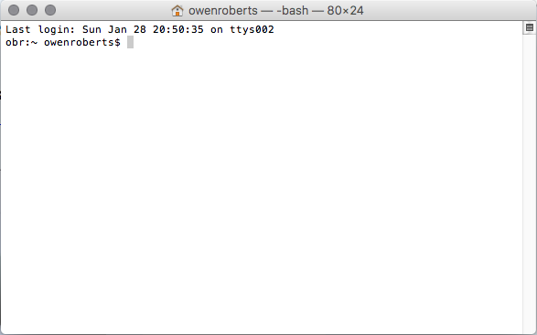

	<h2>Terminal</h2>
	
<note>Terminal</note> is a Mac application that emulates a terminal or text-based controller for the operating system.

	
The command line interface is useful for developers using software that requires command line interface or is extended through command line, including software we'll be using like <note>Git</note> and <note>Sass</note>.

	
The Terminal uses a language called <note>Unix</note> to issue commands to the operating system.

	

	<h2>Commands</h2>
	
In the Terminal, commands are made by typing the command shorthand and hitting Enter/Return R.

	
Many commands have arguments, or extra information for the command.  The arguments are separated by spaces.

	<pre><code>$ command argument
$ cd Desktop
$ mkdir mmp350
$ touch index.html</code></pre>

	<h2>Essential Unix commands</h2>
	<table class="code">
		<tr>
			<th>Command</th>
			<th>Function</th>
			<th>Examples</th>
		</tr>
		<tr>
			<td>cd &lt;path&gt;</td>
			<td>change directory</td>
			<td>cd Desktop  
			cd mmp350  
			cd ..</td>
		</tr>
		<tr>
			<td>ls &lt;path&gt;</td>
			<td>list contents of directory</td>
			<td>ls  
			ls -l  
			ls -a  
			ls /Applications/</td>
		</tr>
		<tr>
			<td>mkdir</td>
			<td>make a new directory</td>
			<td>mkdir my-project</td>
		</tr>
		<tr>
			<td>touch</td>
			<td>create a file</td>
			<td>touch index.html 
			touch css/style.css</td>
		</tr>
		<tr>
			<td>rm</td>
			<td>remove a file 
			note: file does <strong>not</strong> go to trash.   
			it's gone forever.</td>
			<td>rm my-project/file.txt</td>
		</tr>
		<tr>
			<td>cp &lt;path&gt; &lt;path&gt;</td>
			<td>copy a file</td>
			<td>cp my-project/css/style.css css/style.css</td>
		</tr>
		<tr>
			<td>mv</td>
			<td>move a file</td>
			<td>mv my-app/style.css new-app/style.css</td>
		</tr>
	</table>

	<h2>Resources</h2>
	<ul>
		<li><a href="https://files.fosswire.com/2007/08/fwunixref.pdf" target="_blank">Unix cheat sheet </a></li>
		<li><a href="https://ss64.com/osx/" target="_blank">Full reference </a></li>
		<li><a href="https://www.lynda.com/Mac-OS-X-10-6-tutorials/Unix-for-Mac-OS-X-Users/78546-2.html" target="_blank">Lynda: Unix for Mac OS X Users</a></li>
	</ul>

